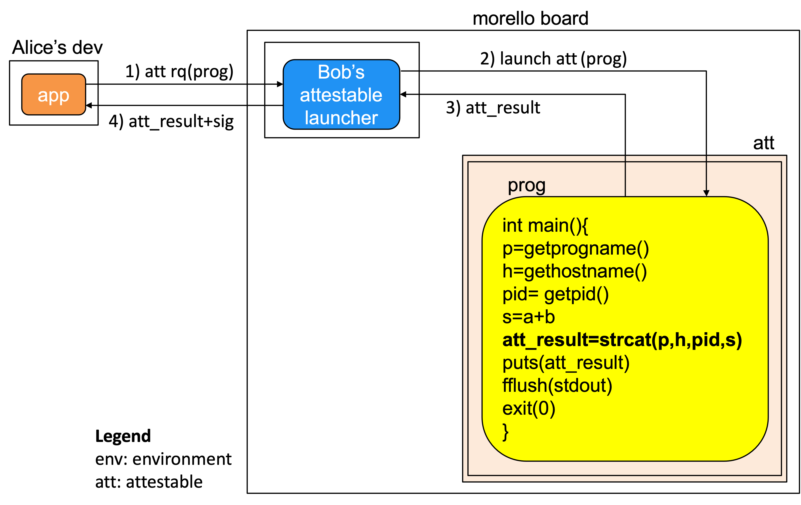
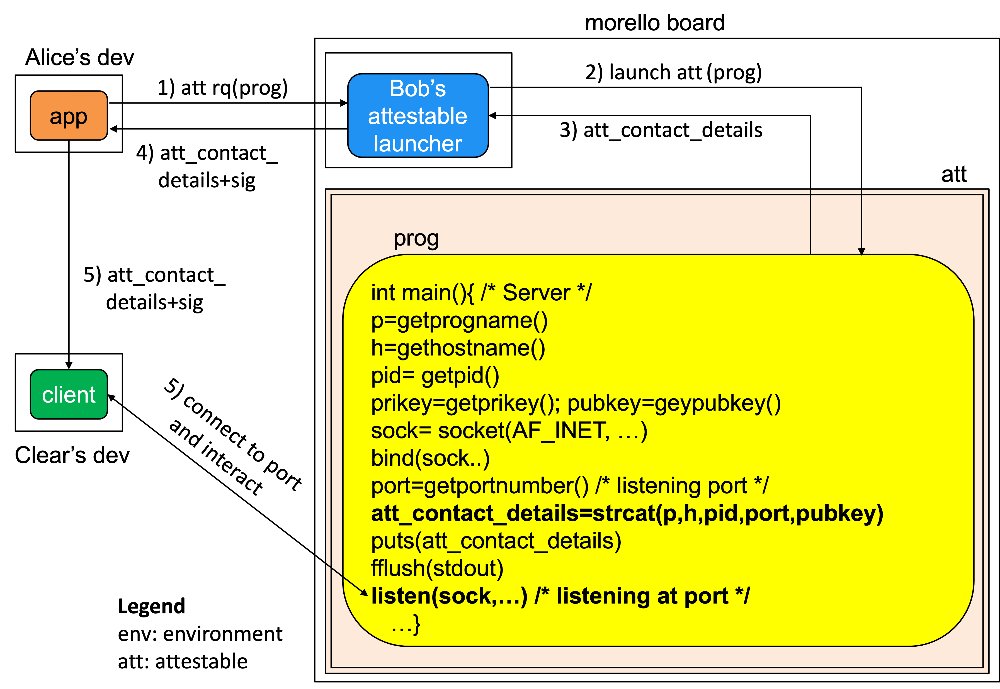

# Attestable Launcher
This page discusses the architecture and implementation
of an attestable launcher that is capable of launching
programs to execute in attestable instantiated on
Morello Boards.

# The attestablelauncher and program execution
An attestable is an execution environment that offers the
following two properties:

1. It is a black box that can be loaded with a piece of
   executable code. 
1. It prevents the observation of its data and idevelopment of 
   its computation.
1. The running code cannot be changed.

In this document, we use __prog__ to refer to the program launched 
into execution. We make no assumptions about ist particularities;
for example, it can be a simple program that adds two integer
or a server thats listen at a port for further interactions.  

 
There are several technologies that can be used for creating attestables,
loading them with programs and launching them into execution. This
page describes the implementation of attestables created on 
Morello Boards. Other technologies that can be used for creating
attestables are Intel SGX, ARM TrustZone and Amazon Nitre.

We use the term __attestable launcher__ to refer to the
program that manages the attestable for the benefit of
the clients  that request them  to execute programs that
involve sensitive data.

Attestable management includes several operation that
the attestable provider (for example, a cloud provider)
has the privilage and responsibility to execute such as
attestable creation, loading it with a program, 
launching the program into execution, the program's collection of
execution results or the program's contact details,
and wipe memory used.

# The attestablelauncher's architecture

The architecture of the attestable launcher that this code implements
is shown in the figure.

  

 

Bob's attestable launcher is a server that Bob can run to
launch attestables   (att1, att2 and att3)
 on Morello Boards and load them with
code (prog1, prog2 and prog3) as requested
by applications (app1, app2 and app3).
 
The attestable launcher responds with a document signed by 
Bob's attestable launcher. The content of that document always
include parameters that describe the configutation of the
attestable such as the name of the launched program, the IP 
hostname of the Morello Board, the PID of the created process
and the result of the launch. We elaborate on the results 
in subsequent sections.
 

# Cloud provider's attestation
The attestation document that Bob's attestable launcher
returns is in essence a certificate of the attestable signed by
Bob's attestable launcher. The latter acts as a trustworthy party.
 
Though not explicitly shown in the figure, BoB can be
a cloud provider that has deployed Morello Boards in his
infrastructure to rent as a cloud service. Potential clients
are owners of application that at some point need exfiltration
resistant execution environments.
 

The following figure illustrates the attestation steps.

  

 

# Attestablelauncher deployment
In the current implementation Bob's attestable launcher and
the attestables (att1, att2 and att3) that the
applications (app1, app2 and app3) have
requested, respectively, are collocated in the same Morello Board.
 However, we collocated them only to simplify the current implementation. Bob's
attestable launcher just an ordinary server that accepts socket
connections and mediates the interaction between the applications and the
attestables, therefore it can be deployed anywhere.

# Results of prog's execution
Programs that the attestableauncher launches into execution
are either:

1. **Non-interactive:** upon launchig, the program executes independently,
   produces a result, send the result to the attestable launcher
   and terminates.

1. **Interactive:** upon launching, the program executes, gathers
   its contact details, sends contact details to the attestable 
   launcher and waits listening at a port for further interactions.

## Launching of a non-interactive program
The following figure illustrates how the attestable launcher
can launch a non-interactive program 

  

 

## Launching of an interactive program
The following figure illustrates how the attestable launcher
can launch an interactive program 

  

 

# Implementation
The current implementation has been coded in Python3
with prog written in C using the library compartmentalization
facilities available from cheriBSD ver 22.12
 
The headings of each file includes the instructions to
compile and execute the attestable launcher and
indicate the platform, Python version and operating
systems where the code has been tested.

The headings also document the cryptographic libraries, operations
and files (public and private keys and certificates) involved.

# Testing: compilation and execution steps
This [compilation and execution example](https://github.com/CAMB-DSbD/attestablelauncher/docs/compile_and_exec_attlauncher_demo_steps.txt "technical demo") document shows the steps to run the
attestable launcher. 

# Documentation
The discussion of the architecture that this repository implements
 is discussed thoroughly in [Cloud Provider's Based Attestation](https://github.com/CAMB-DSbD/attestablelauncher/blob/main/docs/CloudProvidersBasedAttestation_carlosmolina.pdf "technical report"). 

 
# Compilation and execution
The current implementation has been coded in Python3
with prog written in C using the library compartmentalization
facilities available from cheriBSD ver 22.12
 
The headings of each file includes the instructions to
compile and execute the attestable launcher and
indicate the platform, Python version and operating
systems where the code has been tested.

The headings also document the cryptographic libraries, operations 
and files (public and private keys and certificates) involved. 
 
 
# Corresponding author  
carlos.molina@cl.cam.ac.uk   
Computer Lab, University of Cambridge.

 
 
