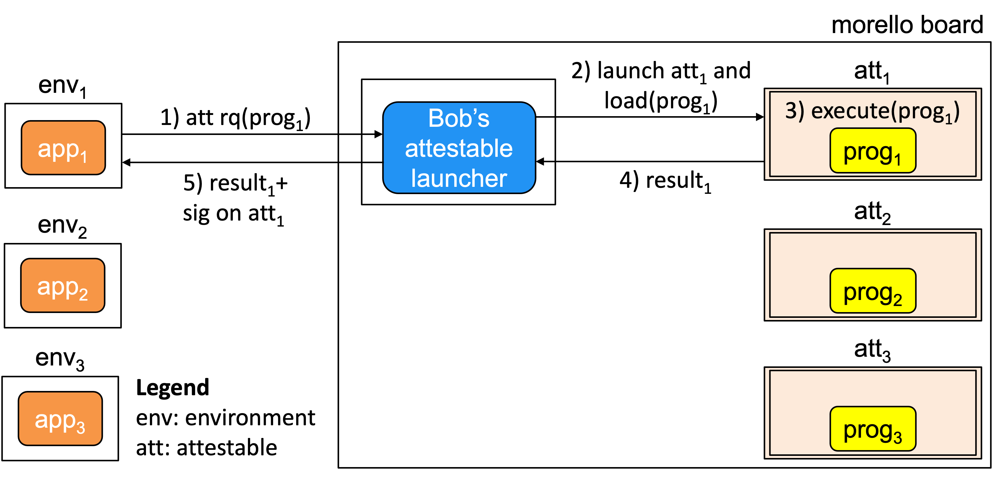

# Attestable Launcher
The architecture of the attestable launcher that this code implements
is shown in the figure.

  

 

Bob's attestable launcher is a server that Bob can run to
launch attestables   (att1, att2 and att3)
 on Morello Boards and load them with
code (prog1, prog2 and prog3) as requested
by applications (app1, app2 and app3).
 
The attestable launcher responds with an attestation document signed by 
Bob's attestable launcher, that describes the configuration of the launched 
attestable.  
 
# Cloud provider's attestation
The attestation document that Bob's attestable launcher
returns is in essence a certificate of the attestable signed by
Bob's attestable launcher. The latter acts as a trustworthy party.
 
Though not explicitly shown in the figure, BoB can be
a cloud provider that has deployed Morello Boards in his
infrastructure to rent as a cloud service. Potential clients
are owners of application that at some point need exfiltration
resistant execution environments.
 

In the current implementation Bob's attestable launcher and
the attestables (att1, att2 and att3) that the
applications (app1, app2 and app3) have
requested, respectively, are collocated in the same Morello Board.
 However, we collocated them only to simplify the current implementation. Bob's
attestable launcher just an ordinary server that accepts socket
connections and mediates the interaction between the applications and the
attestables, therefore it can be deployed anywhere. 

# Documentation
 The discussion of the architecture that this repository implements
 is discussed thoroughly in [Cloud Provider's Based Attestation](https://github.com/CAMB-DSbD/attestablelauncher/blob/main/docs/CloudProvidersBasedAttestation_carlosmolina.pdf "technical report")). 

 
# Compilation and execution
The current implementation has been coded in Python3
with prog written in C using the library compartmentalization
facilities available from cheriBSD ver 22.12
 
The headings of each file includes the instructions to
compile and execute the attestable launcher and
indicate the platform, Python version and operating
systems where the code has been tested.

The headings also document the cryptographic libraries, operations 
and files (public and private keys and certificates) involved. 
 
 
## Corresponding author  
carlos.molina@cl.cam.ac.uk

 
 
