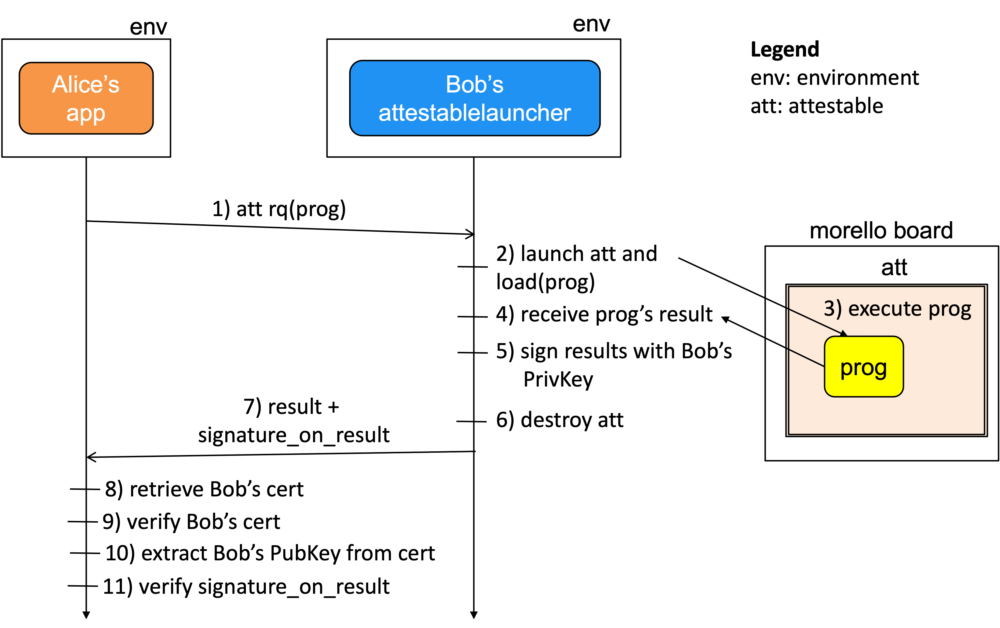

# Attestable launcher
This page discusses the architecture and implementation
of the attestable launcher, a program that, upon request,
is capable of launching an attestable on a morello board,
loading it with a piece of executable code, launching
the code into execution and collecting the results.


# The attestablelauncher and program execution
An attestable is an execution environment that offers the
following three properties:

1. It is a black box that can be loaded with a piece of
   executable code. 
1. It prevents the observation of its data and idevelopment of 
   its computation.
1. The running code cannot be changed.

In this document, we use __prog__ to refer to the program launched 
into execution by the attestable launcher. We make no assumptions about 
its particularities: for example, it can be a simple program that adds two 
integers or a server thats listen at a port for further interactions.  


</br>
There are several technologies that can be used for implementing
attestables.  This
page describes the implementation of attestables implemented on 
Morello Boards. Other technologies that can be used for implementing 
attestables are Intel SGX, ARM TrustZone and Amazon Nitre.

We use the term __attestable launcher__ to refer to the
program that manages the attestable for the benefit of
the clients  that request them  to execute programs that
involve sensitive data.

Attestable management includes several operations that
the attestablelauncher (for example, a cloud provider)
has the privilage and responsibility to execute on behalf 
of the attestable provider. The attestable provider can be
for instance, a cloud provider who has deployed Morello Boards
in his cloud infrastructure and rent attestable to clients.
The list of operations includes the launching of the 
attestable, loading it with an executable program, 
launching the program into execution, collection of 
the program's result and  memory wipe.


# The attestablelauncher's architecture

The architecture of the attestable launcher that this code implements
is shown in the figure.

<p align="center">
  
</p>
</br>

Bob's attestable launcher is a server that Bob can run to
launch attestables   (att<sub>1</sub>, att<sub>2</sub> and att<sub>3</sub>)
 on Morello Boards and load them with
code (prog<sub>1</sub>, prog<sub>2</sub> and prog<sub>3</sub>) as requested
by applications (app<sub>1</sub>, app<sub>2</sub> and app<sub>3</sub>).
</br>
The attestable launcher responds with a document signed by 
Bob's attestable launcher. The document's content always
includes parameters that describe the configutation of the
attestable such as the name of the launched program, the IP address 
and hostname of the Morello Board, the PID of the created process
and the result of the launch. We elaborate on the results 
in subsequent sections.
</br>


# Cloud provider's attestation
The attestation document that Bob's attestable launcher
returns is in essence a certificate of the attestable signed by
Bob's attestable launcher. The latter acts as a trustworthy party.
</br>
Though not explicitly shown in the figure, Bob can be
a cloud provider that has deployed Morello Boards in his
infrastructure to rent as a cloud services. Potential clients
are owners of application that at some point need exfiltration
resistant execution environments.
</br>

The following figure illustrates the attestation steps.

<p align="center">
  
</p>
</br>

We  do not elaborate on the attestation because it is
discussed thoroughly in [Cloud Provider's Based Attestation](https://github.com/CAMB-DSbD/attestablelauncher/blob/main/docs/CloudProvidersBasedAttestation_carlosmolina.pdf "technical report"). 


# Attestablelauncher deployment
In the current implementation, Bob's attestable launcher and
the attestables (att<sub>1</sub>, att<sub>2</sub> and att<sub>3</sub>) that the
applications (app<sub>1</sub>, app<sub>2</sub> and app<sub>3</sub>) have
requested, respectively, are collocated in the same Morello Board.
 However, we collocated them only to simplify the current implementation. Bob's
attestable launcher just an ordinary server that accepts socket
connections and mediates the interaction between the applications and the
attestables, therefore it can be deployed anywhere.


# Results of prog's execution
Programs that the attestableauncher launches into execution
are either:

1. **Non-interactive:** upon launchig, the program executes independently,
   produces a result, send the result to the attestable launcher
   and terminates.

1. **Interactive:** upon launching, the program executes, gathers
   its contact details, sends contact details to the attestable 
   launcher and waits listening at a port for connection requests
   from applications for further interactions.


## Launching of a non-interactive program
The following figure illustrates how the attestable launcher
can launch a non-interactive program; in this example, __prog__ (running
within the yellow box) is responsible for adding two integers.
The yello box is in essence a memory region allocated within the
atttestable box (__att__).

<p align="center">
  
</p>
</br>
Prog's pseudocode shows that progs exits after sending __att_results___
which include the result of the addition.


## Launching of an interactive program
The following figure illustrates how the attestable launcher
can launch an interactive program. 

<p align="center">
  
</p>
</br>
Prog's pseudocode shows that progs dynamically creates
a pair of private/public keys and a listening port.
The public key and the port number are included in
the contact details that prog sends to the attestable
launcher. Observe that after sending its contact details,
prog blocks listening for connections at the port.

In the figure, the client in the green box is an 
application that after receiving prog's contact details
can connect to and interact with prog. It is up to Alice
to determine what applications are entitled to interact
with prog.  The IDs of such applications can be encoded
in prog, for example, prog can be programmed to accept
connections only from the owner of public keys pubkeyC
and pubKeyD.


# Implementation
We will refer to the last figure to explain the technology
used for the implementation of the different pieces of code. 

1. The current implementation of the attestable launcher (blue box)
   has been coded and tested in Python3 (3.7.4 v3.7.4:e09359112e, 
   Jul 8 2019). 
1. The application (orange box) that contacts the attestable launcher with
   a request to launch __prog__ has been implemented
   in Python3.
1. The program __prog__ (yellow box) launched into execution has been
   coded in C. 
1. The actual attestable (pink box) has been coded in C using the library 
   compartmentalization facilities available from cheriBSD ver 
   22.12. 
   </br>
   However, observe that in this demo, the attestable DOES NOT
   running in the actual Morello Board. That part of the
   demo is pending. 
1. The client (green box) that interacts with __prog__ has been implemented 
   in C and is a conventional client that request a connection at
   the port number retrieved from prog's contact details.
</br>


 

# Testing: compilation and execution steps
We elaborate the discuss each piece of code mentioned in the previos section,
The information provided in this section complements (sometimes repeats) the 
comments included  in the first lines of each file. It also provides links
to documents with actual executions and collected outputs. 
</br>
It is worth clarifying that I collected the outputs from different
runs, therefore the dynamic outputs (prog's listening port number and
public key in particular) might not match in all the documents.

 
 

## The attestable launcher (attestablelauncher.py)
The attestable launcher is represented by the blue boxes in the figures.
The [attestable launcher demo steps](https://github.com/CAMB-DSbD/attestablelauncher/blob/main/docs/attlauncher_demo_steps.txt "technical demo") document shows how to 
compile and run the attestable launcher. 


## The application requesting an attestable (cliRqExecProgInAttestable.py)
The attestable launcher is represented by the blue box in the figures.
The [application demo steps](https://github.com/CAMB-DSbD/attestablelauncher/blob/main/docs/application_demo_steps.txt "technical demo") document shows the steps to run the application. 


## The launched program (sersndrcv_host_pid_port_pubkey.c).
This component is represented by the yellow boxes in 
the figures. Any piece of executable code can be used. I have experimented with
the C programs included in the repo hello.c, hellopidhostename.c
clisocketsendrecvPort80.c and sersndrcv_host_pid_port_pubkey.c
</br>
In the runs shown in this documents, I used sersndrcv_host_pid_port_pubkey.c
beause it interactive and as such it dynamically generates a 
port for listening and a pair of private/public keys.

</br> The code for generating the private/public ker is explained
in the comments of generate_pripubkey_func.c. In  brief, I
resorted to the use of fork() and execl() to execute 
the online oppenssl tool.

The [generate_pripubkeys_demo_steps.txt](https://github.com/CAMB-DSbD/attestablelauncher/blob/main/docs/generate_pripubkeys_demo_steps.txt "technical demo") document 
shows the pragmatic (not necessarily efficient or platform
independent) strategy that I used. It is good enough to for
proof of concepts.

</br> 
The program generate_pripubkey_func.c can generate
pairs of pri/pub keys independently. It calls  
generate_pripubkey_func.c


## The application interacting with prog (clisndrcv_host_pid_port_pubkey.c)
This component is represented by the green box in the figures. Any piece of 
executable code that is capable of sending TCP/IP connection request to
the port retrieved from prog's contact details can be used. 
 I have experimented with clisndrcv_host_pid_port_pubkey.c
which sends a connection request against sersndrcv_host_pid_port_pubkey.c
and receives a response. In the experiments, the interaction between
clisndrcv_host_pid_port_pubkey.c and sersndrcv_host_pid_port_pubkey.c
is in plain text, yet, the public key of sersndrcv_host_pid_port_pubkey.c
is available. I do not use it in this demo to save time.

```
bash-3.2$ cli 127.0.0.1 51365
The serverhostname is : 127.0.0.1 60768
Connected

Reply received from server: 
Hello Client , Ive received your connection. But I have to go now, bye
```


# Additional documentation
The discussion of the architecture that this repository implements
 is discussed thoroughly in [Cloud Provider's Based Attestation](https://github.com/CAMB-DSbD/attestablelauncher/blob/main/docs/CloudProvidersBasedAttestation_carlosmolina.pdf "technical report"). 
 
 
# Corresponding author  
carlos.molina@cl.cam.ac.uk   
Computer Lab, University of Cambridge.

 
 
